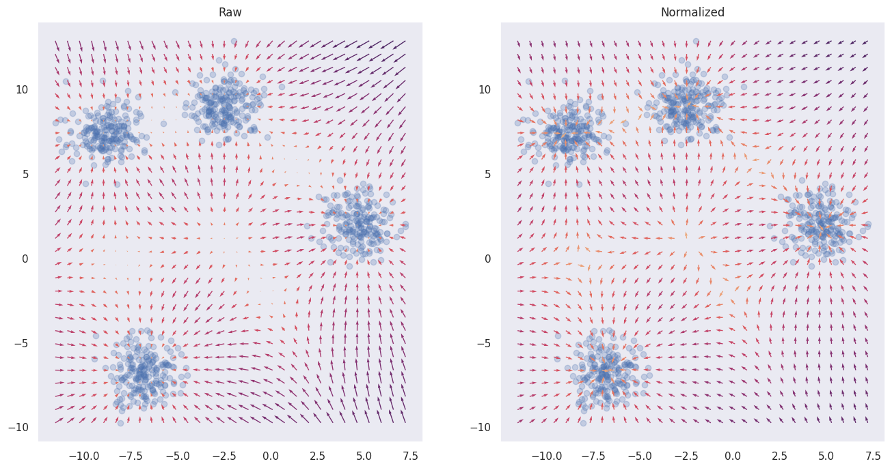
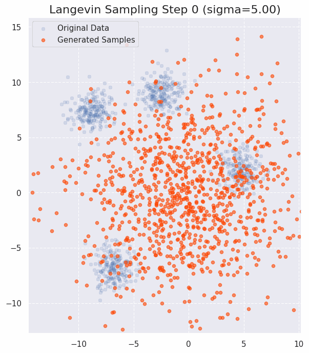

<!-- Epdata(x)
tr(∇xsθ(x)) + 1/2 ksθ(x)k^2 -->

This is the objective function for training a score-based model via score matching.

$$
\Large
\mathbb{E}_{p_{\text{data}}(\mathbf{x})}\left[\mathrm{tr}(\nabla_{\mathbf{x}}\mathbf{s}_{\theta}(\mathbf{x})) + \frac{1}{2}\|\mathbf{s}_{\theta}(\mathbf{x})\|_{2}^{2}\right]
$$
{: .hover-shadow}

Sampling via Langevin dynamics is given by:

$$
\Large
\tilde{\mathbf{x}}_t = \tilde{\mathbf{x}}_{t-1} + \frac{\epsilon}{2} \nabla_{\mathbf{x}} \log p(\tilde{\mathbf{x}}_{t-1}) + \sqrt{\epsilon} \mathbf{z}_t
$$

